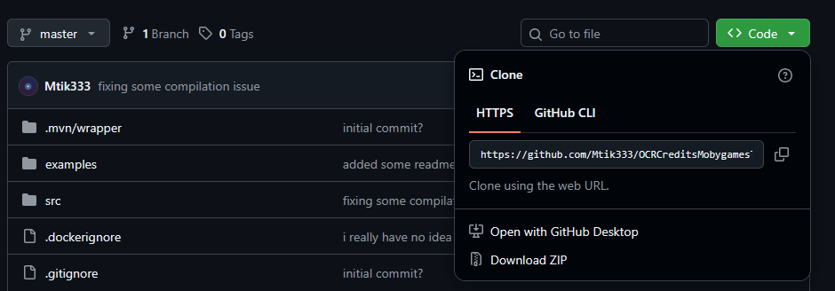
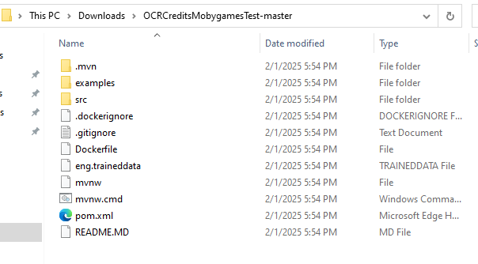
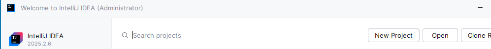
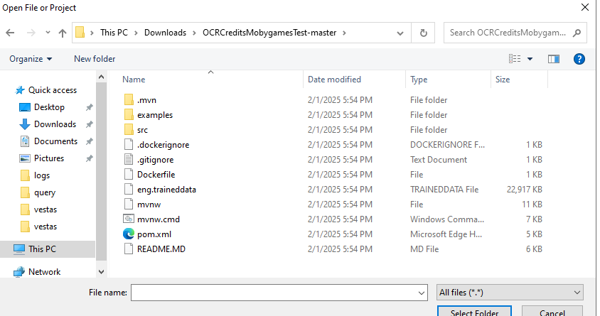
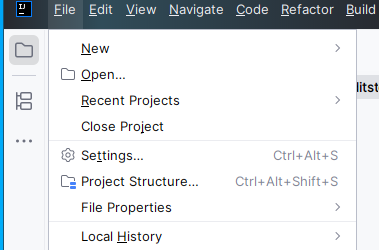
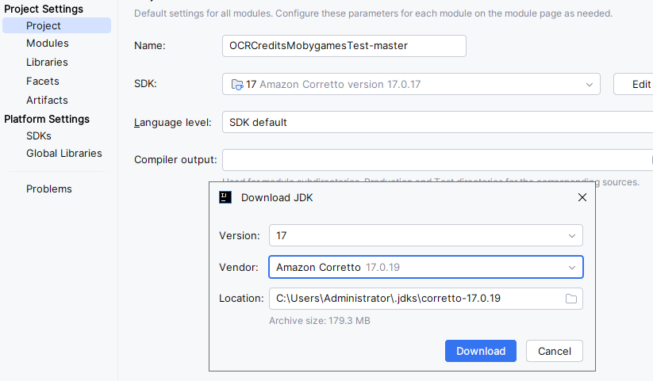
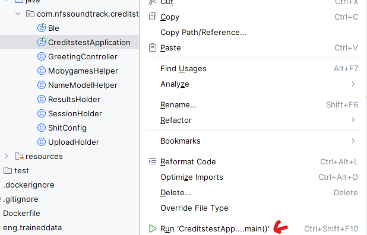
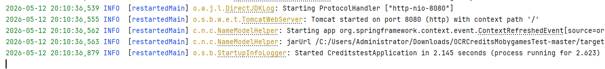
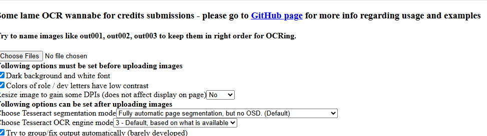

Deploying OCR Tool locally

1. Install IntelliJ (Community Edition) or the most recent one if you don’t mind \- [https://www.jetbrains.com/idea/download/?section=windows](https://www.jetbrains.com/idea/download/?section=windows)

2. Go to [https://github.com/Mtik333/OCRCreditsMobygamesTest](https://github.com/Mtik333/OCRCreditsMobygamesTest) and hit “Code” \- Download ZIP

3. Unpack it somewhere

4. Start IntelliJ and hit “Open”

5. Select the folder with the unpacked content of ZIP

6. IntelliJ might complain about missing Java 17, so go to Project Structure

and download Java 17 if necessary (recommended Amazon Corretto)

7. Navigate to CreditstestApplication.java and right-click on it \- Run  

8. Verify that output shows that application started successfully

9. Go to [http://localhost:8080/greeting](http://localhost:8080/greeting) and use some screenshots to do OCRing

